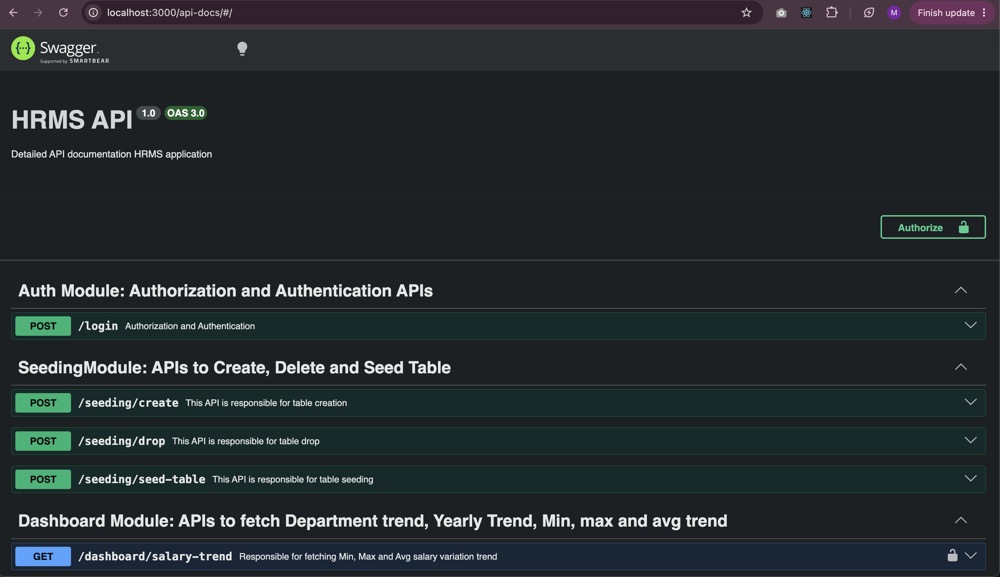
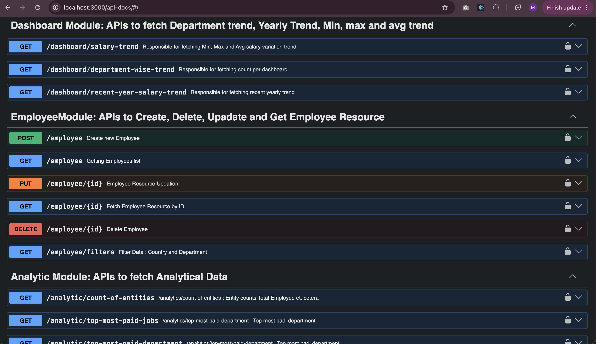
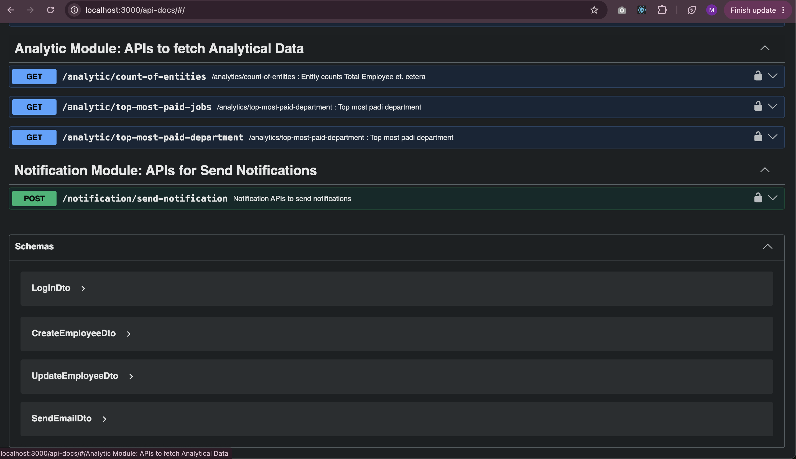

# HRMS App

## Description

Platform to analyze and evaluate operational resources of oraganization.

## Project setup

```bash
$ npm install
```

## Compile and run the project

```bash
# development
$ npm run start

# watch mode
$ npm run start:dev

# production mode
$ npm run start:prod
```

## Swagger API DOCS





## Run tests

```bash
# unit tests
$ npm run test

# e2e tests
$ npm run test:e2e

# test coverage
$ npm run test:cov
```

## Deployment

## Stay in touch

- Author - [Manisha Jadhav](https://github.com/msjadhav03)
